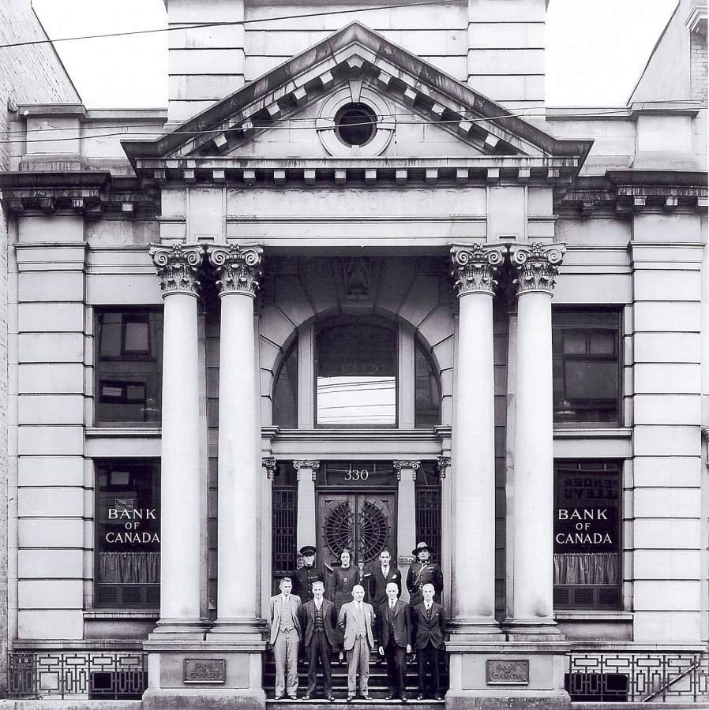

The physical headquarters of [[Internet Archive Canada]]. 330 West Pender Street in Downtown Vancouver, just a block from the DCTRL hackerspace.

> Erected a century ago, the venue is named after the BC Permanent & Loan Company, which first opened its’ doors in 1907. In 1935, the Bank of Canada called this place home, leaving it's mark for decades to come. Recently, The Permanent was completely restored, bringing a landmark, heritage space back to the community. 
>
> The original Bank of Canada vault door still stands tall at the head of our main hall, with the jaw-droppingly beautiful stained glass atrium over head. Other neo-classical elements are adorned through out - in the crown mouldings, the bronze chandeliers, and the many tile mosaics. State of the art equipment has been installed through out as well as a custom 16 foot heritage bar. 
>
> <https://www.thepermanent.ca/the-space>

## Availability

Use the form to check for availability. 